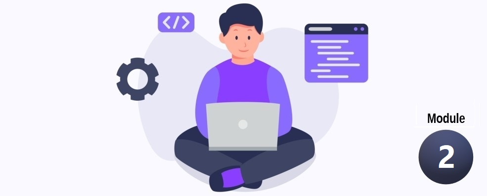

  <b>A course in my <a href="https://github.com/abeerration/CS-Self-Education">CS Self Education</a> series</b>
  <h1>Coding Tutorial – Module 2</h1>
  

  
    <a href="https://www.vecteezy.com/vector-art/4865921-programmer-people-concept-use-laptop-and-programming-code-program-icon-spreading-with-modern-flat-style">Vector</a> by Vecteezy
  

---

## Prerequisites

None

## Description & Goals

This introductory course offers a quick first dive into coding using HTML/CSS/JavaScript web development and Python.

The course comprises of two modules.

- [**Module 1**](https://github.com/abeerration/Coding-Tutorial-Module-1) teaches hands-on web development basics.
- [**Module 2**](https://github.com/abeerration/Coding-Tutorial-Module-2) comprises of Python and more web development, backed with a bit more computer theory.

---

## Materials

| # | Cover | Title |
| ----------- | ----------- | ----------- |
| **1.** |  | <h4><i>DK</i></h4><h2>Beginner's Step-By-Step Coding Course</h2><h4>Dorling Kindersley Limited</h4>
2020

<i>Book</i>
 |
---

## Course Work

| # | Activity | Type | Date / Duration | Description / Notes | Links |
| ----------- | ----------- | ----------- | ----------- | ----------- | ----------- |
| **1.** | ... | ... | ... | ... | ... |
